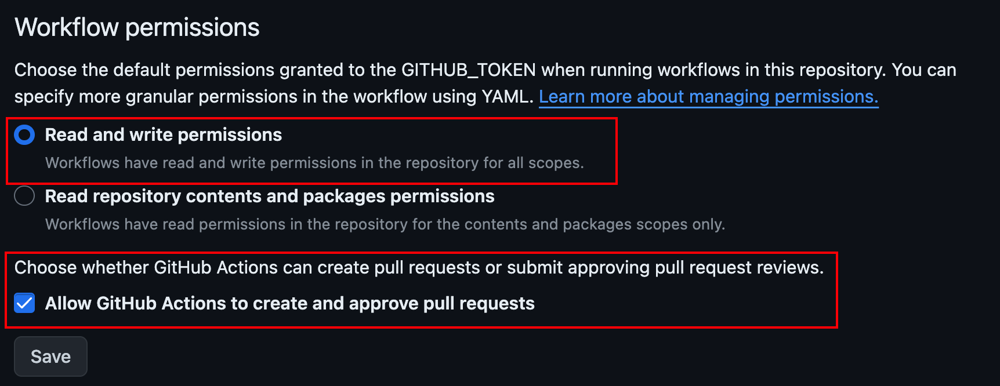

# Monorepo Changelog Example

An example that utilizes release-please to automatically generate independent changelogs in a JavaScript monorepo.

## How to Use Release-please

### Prepare Release-please Configuration and Manifest

Add `release-please-config.json` in the root directory:

```javascript
{
  "packages": {
    // Specify the path for every package in the "packages" field.
    "packages/a": {
      // The "component" field specifies the tag name by release-please.
      // If not set, release-please will use the package name and remove @scope prefix to tag.
      "component": "b"
    },
    "packages/b": {
      "component": "a"
    }
  },
  // It specifies where to update the version. In Node.js, it will update the "package.json" version field.
  "release-type": "node",
  // To support monorepo, we need to specify the workspace plugin.
  "plugins": ["node-workspace"],
  // Schema for autocompletion, not used in release-please.
  "$schema": "https://raw.githubusercontent.com/googleapis/release-please/main/schemas/config.json"
}
```

Add `.release-please-manifest.json` manually; do not use the release-please bootstrap command because it may throw errors for monorepos:

```javascript
{
  // Path to the package, release-please will update the version in this field and also in "package.json".
  "packages/a": "0.1.0",
  "packages/b": "0.1.0"
}
```

### Action Permissions
Release-please requires the following permissions:

```yaml
  contents: write
  pull-requests: write
```

After adding these permissions, you also need to set action permission settings in repo/org settings: `Repo/Org settings -- Actions -- General`



> If you use GITHUB_TOKEN for release-please-action, be aware that it cannot trigger other actions. If you want to trigger other actions, you need to create an organization PAT or user PAT. Refer to [Github Credential](https://github.com/google-github-actions/release-please-action?tab=readme-ov-file#github-credentials) for more details.

## Reference

- [release-please](https://github.com/googleapis/release-please)
- [release-please-action](https://github.com/google-github-actions/release-please-action)
- [Streamlining Development through Monorepo with Independent Release Cycles](https://devblogs.microsoft.com/ise/streamlining-development-through-monorepo-with-independent-release-cycles)
- [npm/cli](https://github.com/npm/cli)